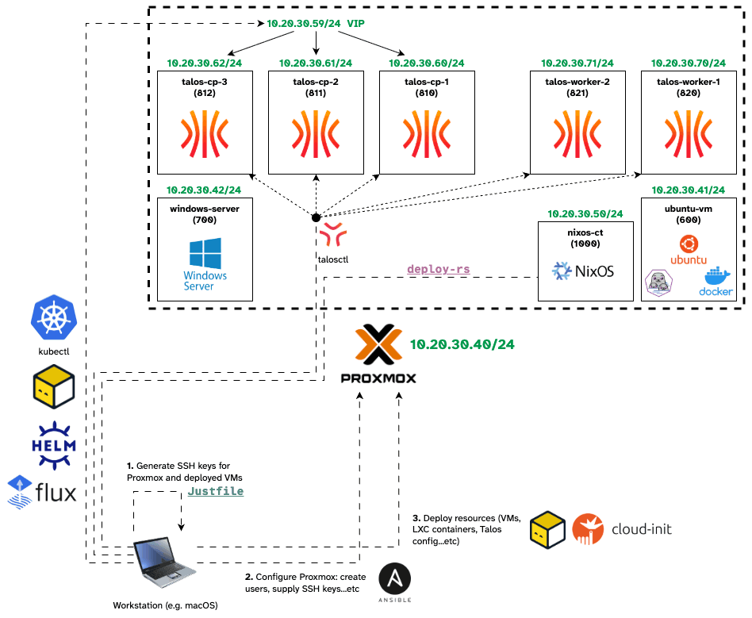

# Home Infrastructure

## Goals (_the what_)

This is essentially a collection of various IaC scripts and definitions whose primary goal is declaratively defining all my home servers and services, as well as providing the ability to bootstrap everything from scratch if needed in the least amount of time and with minimal manual setup.

Another goal is flexibility. E.g., one would ask, why not deploy k8s on bare metal and skip the abstraction layer (and the extra maintenance that comes with it) of the hypervisor with Proxmox? The simple answer is flexibility: what if I want to run a VM? or try/deploy something quickly? or play with Docker/Podman? or even use Windows Server for some reason (I have a VM definition ready).

## Motivation (_the why_)

I aim for this homelab to be a learning and experimentation playground, where I can try different tools (for evaluation) or services (to see if they add value to my life). I also get the benefit of privacy, digital sovereignty, and data ownership. Plus homelabbing and self-hosting are simply fun, they can turn into an addictive hobby on their own.

The reason I'm using what some would call "overkill" technologies and platforms (like k8s) in a home setup is that I also want my own infrastrcture to be as closely aligned as possible to industry standards and enterprise tooling and tech stacks.

## Implementation (_the how_)

This is an ever-evolving design and the approaches and technologies being employed here are constantly changing. Some of these technologies include:

  
  
  
  
  
  
  
  
  
  
  
  
  
  
  
  
  
  

**Architectural Overview**

I try to have a solid foundation to build upon which is why my Hypervisor layer (Proxmox) is intentionally minimal: there is little configurations or changes from the default apart from the baseline hardening, SSH, and storage setup done through Ansible.
