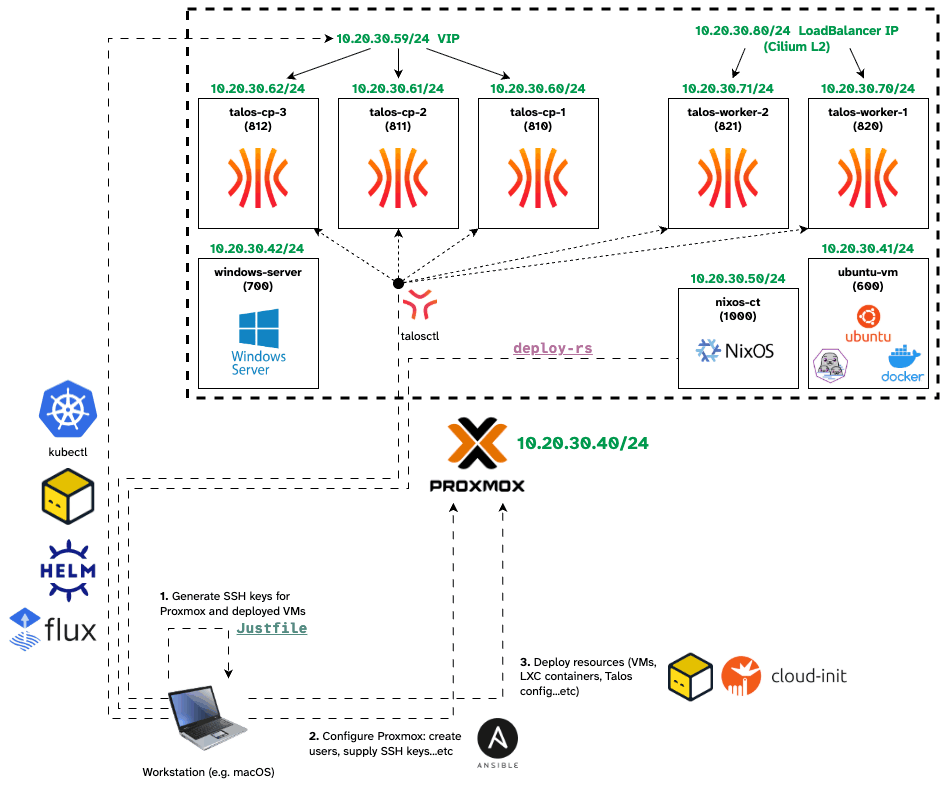
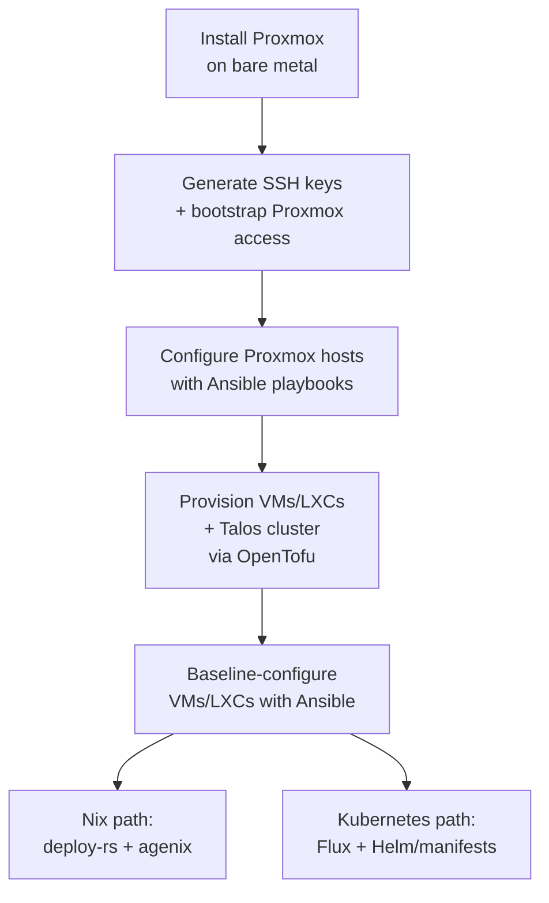

# Home Infrastructure

> A declarative, GitOps-driven homelab on Proxmox, Talos Linux, NixOS, and Kubernetes.

  

## Table of Contents

- [Overview](#overview)
- [Quick Start](#quick-start)
- [Implementation](#implementation)
  - [Workflow](#workflow)
  - [Nix](#nix)
  - [Kubernetes](#kubernetes)
  - [Networking](#networking)
  - [Observability](#observability)
- [Services](#services)
- [Roadmap](#roadmap)
- [Acknowledgements](#acknowledgements)
- [License](#license)

## Overview

This is essentially a collection of various IaC scripts and definitions whose
primary goal is declaratively defining all my home servers and services, as well
as providing the ability to bootstrap everything from scratch in the least amount
of time and with minimal manual setup. The observability stack gradually introduced
aims to keep infrastructure and services continuously reliable.

I aim for this homelab to be a learning and experimentation playground, where I
can try different tools (for evaluation) or services (to see if they add value to
my life). I also gain the benefit of privacy, digital sovereignty, and data ownership.
Plus homelabbing and self-hosting are just fun; they quickly turned into an addictive
hobby on their own.

The reason I'm using what some would consider "overkill" technologies and platforms
(like k8s) for a homelab setup is that I also want my own infrastructure to be as
closely aligned as possible to industry standards and to enterprise tooling and
tech stacks.

Flexibility is another goal. E.g., one would ask, why not deploy k8s on bare metal
and skip the abstraction layer (and the accompanying maintenance overhead) of the
Proxmox hypervisor? The simple answer is flexibility: what if I want to run other
VMs? or to quickly deploy and experiment with some new technology? or to play with
Docker/Podman? or even to use Windows Server for some reason (I have a VM definition
ready)?

This flexible setup also allows me to make use of two different approaches for deploying
and configuring applications, and without much hassle: declarative `systemd` services
as NixOS modules vs. containerised applications running on a platform like Docker
or k8s.

## Quick Start

To get started you need `mise` and `just` installed. Then executing the `just` command
anywhere inside the repo will show all the available recipes. This includes a
step-by-step numbered sequence for getting the infrastructure up and running.

`just bootstrap` will take care of installing all the required CLIs locally through
`mise`.

Common utility commands for deployment (which are likely to be triggered more frequently)
are grouped together per the respective platform (Kubernetes vs. Nix).

> [!NOTE]
> You can also use `just --choose` to fuzzy find available recipes.

## Implementation

This is an ever-evolving design which has gone through major changes over time.
The approaches and technologies employed here are constantly changing. Some of these
technologies include:

<table>
  <tr>
    <td align="center" width="110"> Proxmox</td>
    <td align="center" width="110"> Talos</td>
    <td align="center" width="110"> NixOS</td>
    <td align="center" width="110"> Docker</td>
    <td align="center" width="110"> Kubernetes</td>
    <td align="center" width="110"> Cilium</td>
  </tr>
  <tr>
    <td align="center" width="110"> Flux</td>
    <td align="center" width="110"> Helm</td>
    <td align="center" width="110"> cert-manager</td>
    <td align="center" width="110"> Longhorn</td>
    <td align="center" width="110"> OpenTofu</td>
    <td align="center" width="110"> Ansible</td>
  </tr>
  <tr>
    <td align="center" width="110"> AdGuard Home</td>
    <td align="center" width="110"> Grafana</td>
    <td align="center" width="110"> Prometheus</td>
    <td align="center" width="110"> Loki</td>
    <td align="center" width="110"> Uptime Kuma</td>
    <td align="center" width="110"> Cloudflare</td>
  </tr>
</table>

I generally try to establish a stable foundation to build upon, which is why my
Hypervisor layer (Proxmox) is intentionally minimal in terms of adjustments: I don't
use HA or Ceph storage, and there are only a few configurations applied to Proxmox
hosts, mainly focusing on baseline hardening, SSH access, and storage setup.

Some of the services I self-host are installed directly on a NixOS LXC container
running privileged on the Proxmox host, and others are containerised and running
on my k8s cluster.

The reason for this split is that certain services I want to be "just working",
without the management and upkeep overhead that comes with k8s or even with containerised
deployments in general. However, this also comes down to the availability of high
quality NixOS modules (which I'm then wrapping with my own custom ones), the number
of options they expose, and the reliability at which configurations are deterministically
applied.

For instance, with my local DNS solution (AdGuard Home), it's easier to define all
the configurations, including DNS re-writes, filtering lists, and even login credentials
(using `agenix`) in one hand-crafted NixOS module file that wraps the AdGuard service
and can be toggled on or off. And the "off" here means the service is gone, binaries
are unlinked, and even the firewall ports previously open are now closed.

This idempotency can be contrasted with a tool like Ansible, which is not _truly_
declarative nor idempotent out of the box: removing a task to install a service
from a playbook and re-running that playbook against the same target machine doesn't
actually remove that service. You have to manually SSH and uninstall the service.

This NixOS setup is made easier because of `deploy-rs` and its included niceties,
like reverting to the previous (working) build right away if a deployment fails,
preventing downtime and service disruption.

For everything else, I prefer the GitOps approach to declaratively define and continuously
deploy my k8s workloads using Flux with Helm releases or handwritten manifests.

### Workflow

```mermaid
flowchart TD
    A[Install Proxmox<br/>on bare metal] --> B[Generate SSH keys<br/>+ bootstrap Proxmox access]
    B --> C[Configure Proxmox hosts<br/>with Ansible playbooks]
    C --> D[Provision VMs/LXCs<br/>+ Talos cluster<br/>via OpenTofu]
    D --> E[Baseline-configure<br/>VMs/LXCs with Ansible]
    E --> F1[Nix path:<br/>deploy-rs + agenix]
    E --> F2[Kubernetes path:<br/>Flux + Helm/manifests]
```

<strong>Detailed steps</strong>

1. After installing Proxmox on bare metal, we start first by generating an SSH key
   pair on the current workstation and then supplying the public key to the Proxmox
   root user. This prepares the Proxmox hosts for configuration management tools
   by bootstrapping access to the hypervisor layer.
   - Everything is done through consecutive `justfile` recipes.
   - A particular location for the generated keys is assumed (see the `justfile`).
2. We can then configure Proxmox hosts with Ansible playbooks.
   - One general playbook will perform basic hardening and preparation like
     disabling SSH password access, creating a regular user, giving it sudo
     access... etc.
   - Another playbook will configure storage on the Proxmox node, which is specific
     to my particular layout for this particular host (and only for this current
     installation).
   - These playbooks also rely on the Proxmox API, and hence a token needs to be
     generated first (e.g. from the host console in the Proxmox Web GUI).
   - For now, the secrets solution for encrypting the token and the
     regular user credentials is Ansible Vault, using a password file whose default
     location is set in `ansible.cfg`.
   - And finally, another playbook will install Prometheus `node_exporter` to
     expose metrics from the Proxmox nodes for scraping and subsequent alerting
     and monitoring.
3. We deploy resources primarily with OpenTofu (Terraform can also be used)
   , and we provision most VMs with static IP addresses (and/or other initialisation
   steps) using CloudInit, either as templates or as the minimal equivalent
   initialisation block from Proxmox.
   - The `bpg/proxmox` provider is used to create VMs and LXC containers. We supply
     it with a similar (or the same) Proxmox API token to the one we used with Ansible.
     We also provide it with SSH credentials (the key generated earlier) to be able
     to perform other tasks not ordinarily possible with the API token access alone,
     as per the provider docs.
   - A `proxmox-hosts.auto.tfvars` file should be created, providing secret values
     for `pve_host_ip`, `pve_host_port`, `pve_host_user`, `pve_host_api_token`,
     `pve_hostname`.
   - We use the official `talos` provider to provision the Talos cluster after
     creating the worker + controlplane VMs (generate secrets, define machine config,
     bootstrap `etcd`... etc).
4. Once VMs / LXC containers are created, further baseline configurations are
   performed using Ansible playbooks as well.
   - We deploy NixOS as a privileged LXC container (unprivileged has caused various
     file permission issues), and hence we require additional steps after creating
     the container because token-based Proxmox API access cannot perform those steps.
     This applies to both the Terraform/OpenTofu provider as well as the
     Ansible collection. So we use an Ansible playbook with imperative commands
     for that purpose.
   - We use a playbook to install and configure Docker and Portainer on the newly
     created Ubuntu VM.
5. At this point, VMs and containers have the required baseline configuration, and
   each can be managed going forward with the specialised tools and technologies
   suitable for each platform. This is also where services and applications are
   deployed. See the [Nix](#nix) and [Kubernetes](#kubernetes) sections below.

### Nix

- `deploy-rs` is used to deploy NixOS configurations to target machines (the
  LXC container).
- Building Linux derivations on macOS requires a linux builder, and for this I'm
  currently using the Determinate Nix distribution of Nix on my macOS machine.
- I write custom modules that wrap the official NixOS ones to add further configurations
  and customise the exposed settings, so that these modules can be readily included
  and toggled for any NixOS target (e.g. if I switch to a VM instead of an LXC
  container).
- I use `agenix` to deploy secrets that I have stored encrypted in this repo.

### Kubernetes

The current cluster deployment goes like this:

1. Once we hit `tofu apply -auto-approve` OpenTofu will start deploying VMs and
   create other resources on Proxmox. This will include the creation of 5 nodes:
   3 controlplane + 2 workers for Kubernetes. Those are defined (along with cluster
   information) in `vm-talos.tf`.
2. After that, OpenTofu will take care of creating machine secrets, machine configurations,
   bootstrapping `etcd`, and applying the config. All in `talos.tf`.

> [!NOTE]
> More steps to come — Flux bootstrap, GitOps reconciliation, and bootstrap secrets are next on the list.

### Networking

At the moment, I'm using two reverse proxies simultaneously: The first is Caddy,
deployed on my NixOS LXC container and is proxying to my Nix services on the
same container as well to Portainer (on a different VM) and to the Proxmox Web
UI (i.e. to the Proxmox host IP). And the second is Cilium through the Gateway
API on my k8s cluster.

The future plan is to consolidate onto one reverse proxy, which is the Gateway API,
and to retire Caddy (disabling the Nix module) but keeping it as an emergency backup.

My local DNS solution is currently AdGuard Home, but I might try Technitium in the
future. In addition to block lists, I have two DNS rewrites configured:

1. The first is a wildcard for all subdomains of `home.murtadha.dev` (which is
   itself a subdomain of my main domain). It directs traffic to `10.20.30.50` where
   my Caddy reverse proxy directs traffic to the appropriate backend (NixOS service
   on the same host).
2. The second is also a wildcard but for `*.k8s.murtadha.dev` this time. Directing
   all traffic to the `homelab` gateway configured in my k8s cluster, which in turn
   acts as a reverse proxy to the services hosted inside the cluster.

Obviously, the existence of two domain names is unnecessary, especially with one
revealing underlying implementation details (`*.k8s`), so in the future, only the
first will be used, directing traffic to the k8s gateway, which will proxy to services
outside the cluster (like those deployed on the NixOS container) if needed.

Both web servers are terminating connections from/to the client with TLS using DNS-01
challenge through Let's Encrypt, and in which certificates are automatically obtained
and renewed through the Cloudflare API.

Cloudflare is my external DNS solution. A token is injected into Caddy's environment
and is stored encrypted in this repo using `agenix`. Similarly, a token is provided
to `cert-manager` inside the k8s cluster but this time it's deployed as a k8s
`Secret` with Flux and the encryption solution is `SOPS`. `cert-manager` takes care
of signing and renewing the certificate which is used by the annotated `Gateway`
resource.

### Observability

> [!NOTE]
> Work in progress — see [Roadmap](#roadmap) for the next observability milestones.

The current setup involves Prometheus (metrics), Alertmanager (alerts),
and Grafana (visualisations) deployed in Kubernetes through the `kube-prometheus-stack`
Helm chart. The Proxmox host has a `node_exporter` installed through an Ansible
playbook and hence it's being scraped along with the k8s nodes.

I installed Uptime Kuma through hand-written manifests, translating the Docker
Compose example they have in the docs into k8s resources.

## Services

| Service | Description | Platform | Status |
|---|---|---|:---:|
| **Syncthing** | File sync between MacBook and homelab; stable device IDs via Nix mean both ends pair automatically with shared ignore patterns and versioning | NixOS module |  |
| **Jellyfin** | Home media server, accessed primarily via Infuse on Apple TV (Swiftfin is a solid alternative) | NixOS module |  |

More services to come.

## Roadmap

- [ ] **Logging stack**: deploy Loki and Alloy to complete the LGTM observability rollout
- [ ] **Reverse proxy consolidation**: route everything through the k8s Gateway API; keep Caddy disabled but available as a fallback
- [ ] **Single domain**: drop `*.k8s.murtadha.dev` and route all traffic via `home.murtadha.dev`
- [ ] **DNS**: evaluate Technitium as a potential AdGuard Home replacement
- [ ] **Flux Operator**: migrate from vanilla Flux (see `plans/flux-operator-migration.md`)
- [ ] **More services** to self-host

## Acknowledgements

_To be added._

## License

This project is licensed under the [MIT License](LICENSE).
