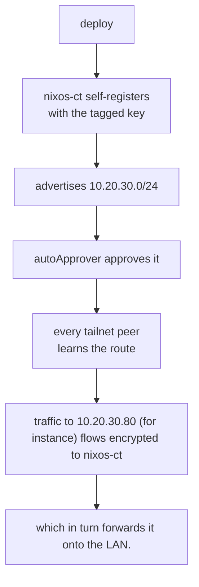

# Tailscale setup

1. Signup (creating a tailnet).
2. Access controls -> Tags -> Create a new tag (`tag:subnet-router`) and set the
   owner.
3. Access controls -> Auto-approver -> Routes -> Add route:
   - Route: `10.20.30.0/24`.
   - Route is auto-approved for: `tag:subnet-router`.
   - Note: auto-approvers don't retroactively approve already-advertised routes.
4. Settings -> Keys -> Generate auth key... (reusable, tagged)
5. Supply it to the Nix module with `agenix` (see [secrets.nix](../Nix/secrets/secrets.nix)).
6. The LXC needs the TUN device + nesting (see the [Ansible playbook](../ansible/playbooks/proxmox-nixos-ct.yaml),
   apply with `just pve-postconfig`).
7. Deploy the Tailscale NixOS module with `deploy-rs` (`just nix-deploy`).
8. Then back to the Tailscale admin console:
   1. DNS → Nameservers → Add nameserver → Custom, then enter your local DNS
      server's (e.g., AdGuard's) tailnet IP (`100.x.y.z`). You can either...
      - Restrict to domain: e.g., `k8s.murtadha.dev` (and repeat for other domains
        like `home.murtadha.dev`) to only direct those DNS queries for those names
        to the local DNS server. Or...
      - Don't restrict to domain, but instead add the server and then toggle 'Override
        DNS servers' to resolve all names outside the tailnet via that address
        (i.e. when away, clients direct *all* DNS queries to the AdGuard server
        at home through the subnet-router).
   2. MagicDNS enabled ✅.
   3. Tailscale disables key expiry by default for tagged devices ✅.

## Workflow

> [!NOTE]
> A **subnet router** is a node that bridges the tailnet and a *physical subnet*:
> it sits on both (`nixos-ct` is on the LAN at `10.20.30.50` and on the tailnet at
> some `100.x.y.z`) and forwards packets between the WireGuard tunnel and the LAN.
