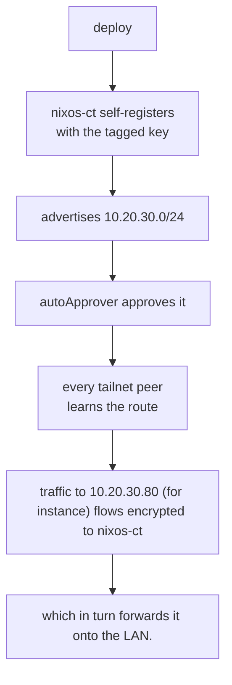

# Tailscale setup

1. Signup (creating a tailnet)
2. Access controls -> Tags -> Create a new tag (`tag:subnet-router`) and set the
   owner.
3. Access controls -> Auto approvers -> routes -> add route:
   - Route: `10.20.30.0/24`
   - Route is auto-approved for: `tag:subnet-router`.
   - Note: auto-approvers don't retroactively approve already-advertised routes.
4. Settings -> Keys -> Generate a new auth key (reusable, tagged)
5. Supply it to the Nix module with agenix.
6. The LXC needs the TUN device + nesting (see the [Ansible playbook](../ansible/playbooks/proxmox-nixos-ct.yaml)).
7. Deploy with `deploy-rs` then back to the admin console:
   1. DNS → Nameservers → Add nameserver → Custom, then enter AdGuard's tailnet
    IP (100.x.y.z). Restrict to domain: k8s.murtadha.dev and repeat for
    other domains like home.murtadha.dev...etc.
       - Or... don't restrict to domain, instead add it and then toggle 'Override
         DNS servers' to resolve all names outside the tailnet via that address
         (i.e. when away, clients direct all DNS queries to Adguard at home via the
         subnet-router).
   2. MagicDNS enabled.
   3. Tailscale disables key expiry by default for tagged devices ✅.

## Workflow

> [!NOTE]
> A **subnet router** is a node that bridges the tailnet and a *physical subnet*:
> it sits on both (`nixos-ct` is on the LAN at `10.20.30.50` and on the tailnet at
> some `100.x.y.z`) and forwards packets between the WireGuard tunnel and the LAN.
